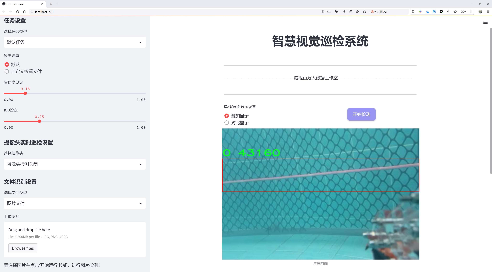
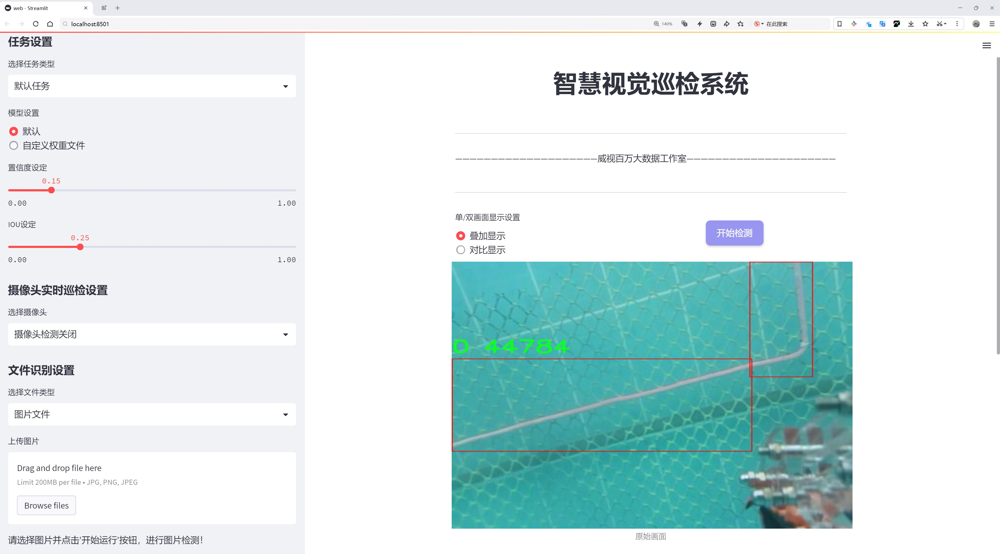
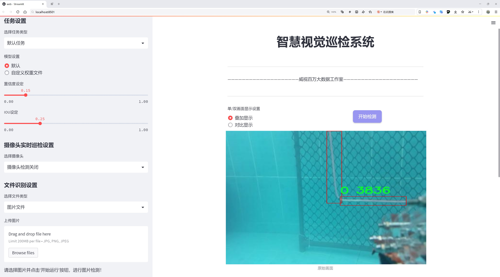
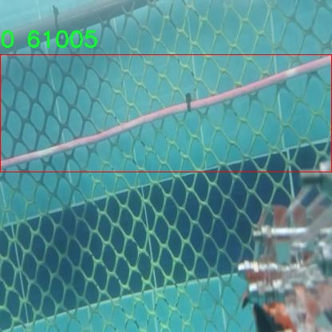
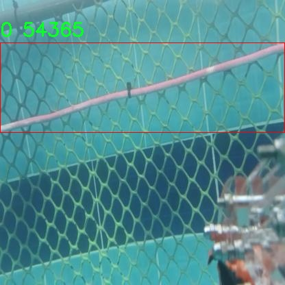
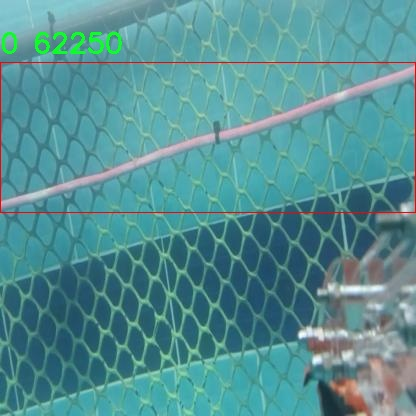
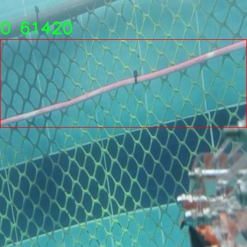
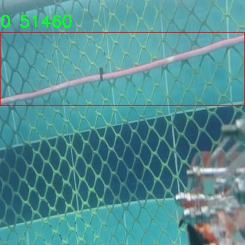

# 泳池软管检测检测系统源码分享
 # [一条龙教学YOLOV8标注好的数据集一键训练_70+全套改进创新点发刊_Web前端展示]

### 1.研究背景与意义

项目参考[AAAI Association for the Advancement of Artificial Intelligence](https://gitee.com/qunshansj/projects)

项目来源[AACV Association for the Advancement of Computer Vision](https://gitee.com/qunmasj/projects)

研究背景与意义

随着智能化技术的迅猛发展，计算机视觉在各个领域的应用愈发广泛，尤其是在物体检测方面。物体检测技术的进步，不仅推动了自动化生产线的效率提升，也为安全监控、交通管理等领域提供了更为精准的解决方案。在众多物体检测算法中，YOLO（You Only Look Once）系列算法因其高效性和实时性而备受关注。YOLOv8作为该系列的最新版本，进一步优化了检测精度和速度，使其在复杂环境下的应用潜力得到极大释放。

泳池软管作为水处理和泳池维护中不可或缺的设备，其安全性和有效性直接影响到泳池的水质和使用者的安全。然而，传统的泳池软管检测方法往往依赖人工检查，不仅效率低下，而且容易出现人为疏漏。基于YOLOv8的泳池软管检测系统的研究，旨在通过深度学习技术，实现对泳池软管的自动化检测与识别，从而提高检测的准确性和效率，降低人工成本，确保泳池环境的安全与卫生。

本研究将使用一个包含1685张图像的数据集，涵盖了两个类别的物体，具体为泳池软管的不同状态和特征。数据集的构建不仅为模型的训练提供了丰富的样本，也为后续的算法优化奠定了基础。通过对这些图像的深入分析与处理，研究将探索如何在不同光照、角度和背景下，提高YOLOv8的检测性能，以适应实际应用中的复杂场景。

在研究意义方面，基于改进YOLOv8的泳池软管检测系统不仅能够为泳池管理提供高效的技术支持，还能推动智能检测技术在水处理行业的应用。通过实现对泳池软管的实时监测，能够及时发现潜在的安全隐患，减少事故发生的概率。此外，该系统的成功应用还将为其他领域的物体检测提供借鉴，推动计算机视觉技术的进一步发展。

综上所述，基于改进YOLOv8的泳池软管检测系统的研究，不仅具有重要的理论价值，还具备广泛的实际应用前景。通过对泳池软管的自动化检测，不仅能够提升泳池管理的智能化水平，还将为行业的安全标准化提供技术保障。未来，随着深度学习技术的不断进步，该系统有望在更广泛的场景中得到应用，推动物体检测技术的普及与发展。

### 2.图片演示







##### 注意：由于此博客编辑较早，上面“2.图片演示”和“3.视频演示”展示的系统图片或者视频可能为老版本，新版本在老版本的基础上升级如下：（实际效果以升级的新版本为准）

  （1）适配了YOLOV8的“目标检测”模型和“实例分割”模型，通过加载相应的权重（.pt）文件即可自适应加载模型。

  （2）支持“图片识别”、“视频识别”、“摄像头实时识别”三种识别模式。

  （3）支持“图片识别”、“视频识别”、“摄像头实时识别”三种识别结果保存导出，解决手动导出（容易卡顿出现爆内存）存在的问题，识别完自动保存结果并导出到tempDir中。

  （4）支持Web前端系统中的标题、背景图等自定义修改，后面提供修改教程。

  另外本项目提供训练的数据集和训练教程,暂不提供权重文件（best.pt）,需要您按照教程进行训练后实现图片演示和Web前端界面演示的效果。

### 3.视频演示

[3.1 视频演示](https://www.bilibili.com/video/BV1pstpeAEaT/)

### 4.数据集信息展示

##### 4.1 本项目数据集详细数据（类别数＆类别名）

nc: 1
names: ['0']


##### 4.2 本项目数据集信息介绍

数据集信息展示

在本研究中，我们采用了名为“line for label”的数据集，以支持对YOLOv8模型的训练，旨在改进泳池软管的检测系统。该数据集专门设计用于满足特定的检测需求，涵盖了泳池软管这一独特类别。数据集的类别数量为1，具体类别列表中仅包含一个标签，标记为‘0’，这意味着该数据集的重点集中在泳池软管的识别与定位上。

“line for label”数据集的构建过程考虑到了泳池软管在实际应用中的多样性和复杂性。数据集中包含了大量的图像样本，这些样本不仅涵盖了不同的泳池软管形态、颜色和材质，还包括了在各种环境条件下拍摄的图像。这种多样性确保了模型在训练过程中能够学习到丰富的特征，从而提高其在实际应用中的鲁棒性和准确性。

在数据采集阶段，研究团队通过多种方式获取了数据集中的图像，包括在不同的泳池环境中拍摄、使用不同的光照条件以及不同的视角。这些图像的采集不仅限于静态场景，还包括动态场景，以模拟真实世界中泳池软管的使用情况。这种多样化的图像数据使得模型能够更好地适应不同的检测场景，提升了模型的泛化能力。

数据集中的图像经过精心标注，确保每个泳池软管在图像中都被准确地框定。这一过程不仅需要高水平的专业知识，还需要对泳池软管的特征有深入的理解。标注的准确性直接影响到模型的训练效果，因此，研究团队在标注过程中采用了严格的质量控制措施，以确保数据的可靠性和有效性。

在数据预处理阶段，研究团队对图像进行了多种处理，以提高模型的训练效率。这包括图像的缩放、裁剪、旋转和颜色增强等操作，旨在生成更多的训练样本，增强模型的学习能力。这些预处理步骤有助于减少过拟合现象，使得模型在面对未见过的数据时能够保持良好的性能。

此外，数据集的划分也经过了精心设计，确保训练集、验证集和测试集的比例合理。这样的划分不仅能够有效评估模型的性能，还能确保模型在实际应用中的可靠性。通过在不同的数据集上进行训练和测试，研究团队能够及时调整模型参数，优化检测效果。

综上所述，“line for label”数据集为改进YOLOv8的泳池软管检测系统提供了坚实的基础。通过对数据集的精心设计和构建，研究团队能够有效地训练出高性能的检测模型，为泳池维护和管理提供更为精准的技术支持。这一数据集的成功应用，不仅为泳池软管的检测提供了新的解决方案，也为未来相关领域的研究奠定了基础。











### 5.全套项目环境部署视频教程（零基础手把手教学）

[5.1 环境部署教程链接（零基础手把手教学）](https://www.ixigua.com/7404473917358506534?logTag=c807d0cbc21c0ef59de5)


[5.2 安装Python虚拟环境创建和依赖库安装视频教程链接（零基础手把手教学）](https://www.ixigua.com/7404474678003106304?logTag=1f1041108cd1f708b01a)

### 6.手把手YOLOV8训练视频教程（零基础小白有手就能学会）

[6.1 手把手YOLOV8训练视频教程（零基础小白有手就能学会）](https://www.ixigua.com/7404477157818401292?logTag=d31a2dfd1983c9668658)

### 7.70+种全套YOLOV8创新点代码加载调参视频教程（一键加载写好的改进模型的配置文件）

[7.1 70+种全套YOLOV8创新点代码加载调参视频教程（一键加载写好的改进模型的配置文件）](https://www.ixigua.com/7404478314661806627?logTag=29066f8288e3f4eea3a4)

### 8.70+种全套YOLOV8创新点原理讲解（非科班也可以轻松写刊发刊，V10版本正在科研待更新）

由于篇幅限制，每个创新点的具体原理讲解就不一一展开，具体见下列网址中的创新点对应子项目的技术原理博客网址【Blog】：


[8.1 70+种全套YOLOV8创新点原理讲解链接](https://gitee.com/qunmasj/good)

### 9.系统功能展示（检测对象为举例，实际内容以本项目数据集为准）

图9.1.系统支持检测结果表格显示

  图9.2.系统支持置信度和IOU阈值手动调节

  图9.3.系统支持自定义加载权重文件best.pt(需要你通过步骤5中训练获得)

  图9.4.系统支持摄像头实时识别

  图9.5.系统支持图片识别

  图9.6.系统支持视频识别

  图9.7.系统支持识别结果文件自动保存

  图9.8.系统支持Excel导出检测结果数据


### 10.原始YOLOV8算法原理

原始YOLOv8算法原理

YOLOv8算法是目标检测领域的一次重要进步，它在YOLO系列模型的基础上进行了深度优化与创新，旨在提升目标检测的准确性和效率。YOLOv8的设计理念围绕着轻量化、高效性和准确性展开，尤其是在YOLOv5的基础上，进一步改进了网络结构和特征提取方法，使其在实际应用中更具实用性。

YOLOv8的核心结构可以分为三个主要部分：骨干特征提取网络、特征融合层和检测头层。骨干特征提取网络负责从输入图像中提取重要的特征信息，而特征融合层则将不同层次的特征进行有效的融合，以便更好地进行目标检测。最后，检测头层则负责将融合后的特征转化为最终的检测结果。

在骨干特征提取网络中，YOLOv8采用了CSPDarknet结构，这是一种交叉阶段部分网络，能够有效地分离和提取特征。与前代模型相比，YOLOv8使用了C2F模块替代了C3模块。C2F模块的设计允许将输入特征图分为两个分支，每个分支经过卷积层进行特征降维，这种结构不仅提高了特征提取的效率，还增强了模型的表达能力。通过堆叠多个v8_C2fBottleneck层，YOLOv8能够生成更高维度的特征图，这些特征图在后续的处理过程中能够提供更丰富的梯度流信息，从而提高模型的学习能力。

特征融合层是YOLOv8的另一大亮点，它结合了特征金字塔网络（FPN）和路径聚合网络（PAN）的优势，能够有效地处理多尺度特征。特征金字塔网络通过自底向上的方式提取不同层次的特征，而路径聚合网络则通过跨层连接，增强了特征的传递和融合能力。这种双重结构的设计使得YOLOv8在处理复杂场景时，能够更好地捕捉到不同尺度的目标信息。此外，YOLOv8还引入了BiFPN网络，通过高效的双向跨尺度连接和加权特征融合，进一步提升了特征提取的速度和准确性。

在检测头层，YOLOv8采用了轻量化的解耦头替代了传统的耦合头，这一创新使得模型在进行目标检测时，能够直接预测目标的中心点及其宽高比例，而不再依赖于锚框的设置。这种无锚框的检测方式显著减少了计算复杂度，提高了检测速度和准确度，尤其在实时应用场景中表现得尤为突出。

YOLOv8的设计还考虑到了模型的轻量化，特别是YOLOv8n版本，旨在降低模型的参数量和计算量，使其能够在资源受限的设备上运行。通过在骨干特征提取网络中使用更轻量化的C2F模块，YOLOv8n能够在保持高效特征提取的同时，显著减少计算资源的消耗。此外，在特征融合层中减少了降采样层的数量，也进一步优化了模型的性能。

总的来说，YOLOv8算法通过对网络结构的深度优化和创新，成功地实现了目标检测的高效性与准确性。其在特征提取、特征融合及目标检测等多个环节的改进，使得YOLOv8在面对复杂场景时，能够更好地应对多样化的目标检测任务。随着YOLOv8的推出，目标检测技术的应用前景愈加广阔，无论是在智能监控、自动驾驶还是工业检测等领域，YOLOv8都展现出了强大的能力和潜力。


### 11.项目核心源码讲解（再也不用担心看不懂代码逻辑）

#### 11.1 70+种YOLOv8算法改进源码大全和调试加载训练教程（非必要）\ultralytics\utils\plotting.py

以下是对代码中最核心部分的提取和详细中文注释：

```python
class Colors:
    """
    Ultralytics 默认颜色调色板。

    该类提供了处理 Ultralytics 颜色调色板的方法，包括将十六进制颜色代码转换为 RGB 值。

    属性:
        palette (list of tuple): RGB 颜色值列表。
        n (int): 调色板中的颜色数量。
        pose_palette (np.array): 特定颜色调色板数组，数据类型为 np.uint8。
    """

    def __init__(self):
        """初始化颜色为十六进制值."""
        hexs = ('FF3838', 'FF9D97', 'FF701F', 'FFB21D', 'CFD231', '48F90A', '92CC17', '3DDB86', '1A9334', '00D4BB',
                '2C99A8', '00C2FF', '344593', '6473FF', '0018EC', '8438FF', '520085', 'CB38FF', 'FF95C8', 'FF37C7')
        # 将十六进制颜色转换为 RGB 并存储在 palette 中
        self.palette = [self.hex2rgb(f'#{c}') for c in hexs]
        self.n = len(self.palette)  # 颜色数量
        # 定义特定的颜色调色板用于姿态估计
        self.pose_palette = np.array([[255, 128, 0], [255, 153, 51], [255, 178, 102], [230, 230, 0], [255, 153, 255],
                                      [153, 204, 255], [255, 102, 255], [255, 51, 255], [102, 178, 255], [51, 153, 255],
                                      [255, 153, 153], [255, 102, 102], [255, 51, 51], [153, 255, 153], [102, 255, 102],
                                      [51, 255, 51], [0, 255, 0], [0, 0, 255], [255, 0, 0], [255, 255, 255]],
                                     dtype=np.uint8)

    def __call__(self, i, bgr=False):
        """将颜色索引转换为 RGB 值."""
        c = self.palette[int(i) % self.n]  # 获取颜色
        return (c[2], c[1], c[0]) if bgr else c  # 如果需要 BGR 格式则返回 BGR

    @staticmethod
    def hex2rgb(h):
        """将十六进制颜色代码转换为 RGB 值."""
        return tuple(int(h[1 + i:1 + i + 2], 16) for i in (0, 2, 4))  # 返回 RGB 元组


class Annotator:
    """
    Ultralytics 注释器，用于训练/验证马赛克和 JPG 及预测注释。

    属性:
        im (Image.Image 或 numpy array): 要注释的图像。
        pil (bool): 是否使用 PIL 或 cv2 绘制注释。
        font (ImageFont.truetype 或 ImageFont.load_default): 用于文本注释的字体。
        lw (float): 绘制的线宽。
        skeleton (List[List[int]]): 关键点的骨架结构。
        limb_color (List[int]): 四肢的颜色调色板。
        kpt_color (List[int]): 关键点的颜色调色板。
    """

    def __init__(self, im, line_width=None, font_size=None, font='Arial.ttf', pil=False, example='abc'):
        """初始化 Annotator 类，设置图像和线宽，以及关键点和四肢的颜色调色板."""
        assert im.data.contiguous, '图像不连续. 请应用 np.ascontiguousarray(im) 到 Annotator() 输入图像.'
        non_ascii = not is_ascii(example)  # 检查是否为非拉丁字符
        self.pil = pil or non_ascii  # 根据是否为非拉丁字符选择使用 PIL
        self.lw = line_width or max(round(sum(im.shape) / 2 * 0.003), 2)  # 计算线宽
        if self.pil:  # 使用 PIL
            self.im = im if isinstance(im, Image.Image) else Image.fromarray(im)  # 将图像转换为 PIL 格式
            self.draw = ImageDraw.Draw(self.im)  # 创建绘图对象
            try:
                font = check_font('Arial.Unicode.ttf' if non_ascii else font)  # 检查字体
                size = font_size or max(round(sum(self.im.size) / 2 * 0.035), 12)  # 计算字体大小
                self.font = ImageFont.truetype(str(font), size)  # 加载字体
            except Exception:
                self.font = ImageFont.load_default()  # 加载默认字体
        else:  # 使用 cv2
            self.im = im
            self.tf = max(self.lw - 1, 1)  # 字体厚度
            self.sf = self.lw / 3  # 字体缩放
        # 定义姿态关键点的骨架结构
        self.skeleton = [[16, 14], [14, 12], [17, 15], [15, 13], [12, 13], [6, 12], [7, 13], [6, 7], [6, 8], [7, 9],
                         [8, 10], [9, 11], [2, 3], [1, 2], [1, 3], [2, 4], [3, 5], [4, 6], [5, 7]]
        # 定义四肢和关键点的颜色
        self.limb_color = colors.pose_palette[[9, 9, 9, 9, 7, 7, 7, 0, 0, 0, 0, 0, 16, 16, 16, 16, 16, 16, 16]]
        self.kpt_color = colors.pose_palette[[16, 16, 16, 16, 16, 0, 0, 0, 0, 0, 0, 9, 9, 9, 9, 9, 9]]

    def box_label(self, box, label='', color=(128, 128, 128), txt_color=(255, 255, 255)):
        """在图像上添加一个 xyxy 框和标签."""
        if isinstance(box, torch.Tensor):
            box = box.tolist()  # 将张量转换为列表
        if self.pil or not is_ascii(label):
            self.draw.rectangle(box, width=self.lw, outline=color)  # 绘制矩形框
            if label:
                w, h = self.font.getsize(label)  # 获取文本宽度和高度
                outside = box[1] - h >= 0  # 标签是否适合框外
                self.draw.rectangle(
                    (box[0], box[1] - h if outside else box[1], box[0] + w + 1,
                     box[1] + 1 if outside else box[1] + h + 1),
                    fill=color,
                )  # 绘制标签背景
                self.draw.text((box[0], box[1] - h if outside else box[1]), label, fill=txt_color, font=self.font)  # 绘制文本
        else:  # 使用 cv2
            p1, p2 = (int(box[0]), int(box[1])), (int(box[2]), int(box[3]))
            cv2.rectangle(self.im, p1, p2, color, thickness=self.lw, lineType=cv2.LINE_AA)  # 绘制矩形框
            if label:
                w, h = cv2.getTextSize(label, 0, fontScale=self.sf, thickness=self.tf)[0]  # 获取文本宽度和高度
                outside = p1[1] - h >= 3
                p2 = p1[0] + w, p1[1] - h - 3 if outside else p1[1] + h + 3
                cv2.rectangle(self.im, p1, p2, color, -1, cv2.LINE_AA)  # 绘制填充背景
                cv2.putText(self.im,
                            label, (p1[0], p1[1] - 2 if outside else p1[1] + h + 2),
                            0,
                            self.sf,
                            txt_color,
                            thickness=self.tf,
                            lineType=cv2.LINE_AA)  # 绘制文本

    def result(self):
        """返回注释后的图像作为数组."""
        return np.asarray(self.im)  # 将 PIL 图像转换为 numpy 数组
```

### 说明
1. **Colors 类**：该类负责定义和管理颜色调色板，提供了从十六进制颜色代码到 RGB 值的转换功能。
2. **Annotator 类**：该类用于在图像上绘制边框、标签、关键点等注释。支持使用 PIL 或 OpenCV 进行绘制，并根据输入图像的格式选择相应的绘制方式。

这些核心部分是实现目标检测和图像注释的基础，能够有效地处理颜色和绘制注释。

这个文件是Ultralytics YOLO（You Only Look Once）模型的一个工具模块，主要用于图像的绘制和可视化。它包含了一些类和函数，用于处理颜色、绘制标注、保存图像等功能。

首先，文件中定义了一个`Colors`类，用于管理颜色调色板。该类初始化了一组颜色（以十六进制表示），并提供了将十六进制颜色转换为RGB格式的方法。这个调色板是Ultralytics默认的颜色方案，适用于绘制检测框和其他可视化元素。

接下来是`Annotator`类，它是用于在图像上添加标注的主要工具。这个类支持使用PIL或OpenCV库进行绘制，能够绘制矩形框、文本、关键点等。`Annotator`类的构造函数接收图像、线宽、字体等参数，并根据输入的图像类型选择合适的绘制方式。该类还定义了一些方法，如`box_label`用于绘制边界框和标签，`masks`用于绘制分割掩码，`kpts`用于绘制关键点。

此外，文件中还定义了一些辅助函数，例如`plot_labels`用于绘制训练标签的统计信息，`save_one_box`用于根据给定的边界框从图像中裁剪并保存图像，`plot_images`用于绘制带有标签的图像网格，`plot_results`用于从CSV文件中绘制训练结果。

文件的最后部分包含了一些用于可视化特征图的函数，允许用户在推理过程中查看模型的特征输出。这些函数可以帮助开发者理解模型在不同阶段的表现。

总体来说，这个文件提供了一系列功能强大的工具，用于在YOLO模型的训练和推理过程中进行可视化，帮助用户更好地理解和调试模型的表现。

#### 11.2 ui.py

```python
import sys
import subprocess

def run_script(script_path):
    """
    使用当前 Python 环境运行指定的脚本。

    Args:
        script_path (str): 要运行的脚本路径

    Returns:
        None
    """
    # 获取当前 Python 解释器的路径
    python_path = sys.executable

    # 构建运行命令，使用 streamlit 运行指定的脚本
    command = f'"{python_path}" -m streamlit run "{script_path}"'

    # 执行命令并等待其完成
    result = subprocess.run(command, shell=True)
    
    # 检查命令执行的返回码，如果不为0则表示出错
    if result.returncode != 0:
        print("脚本运行出错。")


# 实例化并运行应用
if __name__ == "__main__":
    # 指定要运行的脚本路径
    script_path = "web.py"  # 这里可以直接指定脚本名称

    # 调用函数运行脚本
    run_script(script_path)
```

### 代码核心部分及注释说明：

1. **导入模块**：
   - `import sys`: 导入系统相关的模块，用于获取当前 Python 解释器的路径。
   - `import subprocess`: 导入子进程模块，用于在 Python 中执行外部命令。

2. **定义 `run_script` 函数**：
   - 该函数接受一个参数 `script_path`，表示要运行的 Python 脚本的路径。
   - 函数内部首先获取当前 Python 解释器的路径，然后构建一个命令字符串，使用 `streamlit` 来运行指定的脚本。

3. **执行命令**：
   - 使用 `subprocess.run` 执行构建的命令，并等待其完成。
   - 检查命令的返回码，如果返回码不为0，表示脚本运行出错，打印相应的错误信息。

4. **主程序入口**：
   - 使用 `if __name__ == "__main__":` 确保只有在直接运行该脚本时才会执行以下代码。
   - 指定要运行的脚本路径，并调用 `run_script` 函数来执行该脚本。

这个程序文件名为 `ui.py`，主要功能是使用当前的 Python 环境来运行一个指定的脚本。程序首先导入了必要的模块，包括 `sys`、`os` 和 `subprocess`，以及一个自定义的路径处理模块 `abs_path`。

在程序中定义了一个名为 `run_script` 的函数，该函数接受一个参数 `script_path`，表示要运行的脚本的路径。函数内部首先获取当前 Python 解释器的路径，这通过 `sys.executable` 实现。接着，构建一个命令字符串，使用 `streamlit` 来运行指定的脚本。这里的命令格式为 `"{python_path}" -m streamlit run "{script_path}"`，其中 `python_path` 是当前 Python 解释器的路径，`script_path` 是传入的脚本路径。

然后，程序使用 `subprocess.run` 方法来执行这个命令。该方法的 `shell=True` 参数允许在 shell 中执行命令。执行完命令后，程序检查返回的结果码，如果结果码不为 0，表示脚本运行出错，此时会打印出错误信息。

在文件的最后部分，程序通过 `if __name__ == "__main__":` 语句来确保只有在直接运行该文件时才会执行以下代码。这里指定了要运行的脚本路径为 `web.py`，并调用 `run_script` 函数来执行这个脚本。

总的来说，这个程序的主要作用是提供一个简单的接口，通过当前的 Python 环境来运行一个名为 `web.py` 的脚本，并处理可能出现的错误。

#### 11.3 70+种YOLOv8算法改进源码大全和调试加载训练教程（非必要）\ultralytics\models\yolo\pose\val.py

以下是经过简化和注释的核心代码部分：

```python
# 导入必要的库
from pathlib import Path
import numpy as np
import torch
from ultralytics.models.yolo.detect import DetectionValidator
from ultralytics.utils import ops

class PoseValidator(DetectionValidator):
    """
    PoseValidator类用于基于姿态模型的验证，继承自DetectionValidator类。
    """

    def __init__(self, dataloader=None, save_dir=None, pbar=None, args=None, _callbacks=None):
        """初始化PoseValidator对象，设置参数和属性。"""
        super().__init__(dataloader, save_dir, pbar, args, _callbacks)
        self.sigma = None  # 用于计算关键点的标准差
        self.kpt_shape = None  # 关键点的形状
        self.args.task = 'pose'  # 设置任务类型为姿态估计
        self.metrics = PoseMetrics(save_dir=self.save_dir, on_plot=self.on_plot)  # 初始化姿态度量

    def preprocess(self, batch):
        """预处理批次数据，将关键点数据转换为浮点数并移动到指定设备。"""
        batch = super().preprocess(batch)  # 调用父类的预处理方法
        batch['keypoints'] = batch['keypoints'].to(self.device).float()  # 转换关键点数据类型
        return batch

    def postprocess(self, preds):
        """应用非极大值抑制，返回高置信度的检测结果。"""
        return ops.non_max_suppression(preds,
                                       self.args.conf,
                                       self.args.iou,
                                       labels=self.lb,
                                       multi_label=True,
                                       agnostic=self.args.single_cls,
                                       max_det=self.args.max_det,
                                       nc=self.nc)

    def init_metrics(self, model):
        """初始化YOLO模型的姿态估计度量。"""
        super().init_metrics(model)  # 调用父类的初始化方法
        self.kpt_shape = self.data['kpt_shape']  # 获取关键点形状
        is_pose = self.kpt_shape == [17, 3]  # 判断是否为姿态模型
        nkpt = self.kpt_shape[0]  # 关键点数量
        self.sigma = OKS_SIGMA if is_pose else np.ones(nkpt) / nkpt  # 设置标准差

    def update_metrics(self, preds, batch):
        """更新度量指标。"""
        for si, pred in enumerate(preds):  # 遍历每个预测结果
            idx = batch['batch_idx'] == si  # 获取当前批次索引
            cls = batch['cls'][idx]  # 获取当前批次的类别
            bbox = batch['bboxes'][idx]  # 获取当前批次的边界框
            kpts = batch['keypoints'][idx]  # 获取当前批次的关键点
            npr = pred.shape[0]  # 当前预测的数量
            shape = batch['ori_shape'][si]  # 获取原始图像的形状
            correct_kpts = torch.zeros(npr, self.niou, dtype=torch.bool, device=self.device)  # 初始化正确关键点矩阵
            correct_bboxes = torch.zeros(npr, self.niou, dtype=torch.bool, device=self.device)  # 初始化正确边界框矩阵
            self.seen += 1  # 更新已处理的样本数量

            if npr == 0:  # 如果没有预测结果
                if cls.shape[0]:  # 如果有类别
                    self.stats.append((correct_bboxes, correct_kpts, *torch.zeros((2, 0), device=self.device), cls.squeeze(-1)))
                continue  # 跳过当前循环

            # 处理预测结果
            predn = pred.clone()  # 克隆预测结果
            ops.scale_boxes(batch['img'][si].shape[1:], predn[:, :4], shape, ratio_pad=batch['ratio_pad'][si])  # 将预测框缩放到原始图像空间
            pred_kpts = predn[:, 6:].view(npr, -1, 3)  # 重新调整关键点的形状

            # 评估
            if cls.shape[0]:  # 如果有类别
                height, width = batch['img'].shape[2:]  # 获取图像的高度和宽度
                tbox = ops.xywh2xyxy(bbox) * torch.tensor((width, height, width, height), device=self.device)  # 转换目标框
                ops.scale_boxes(batch['img'][si].shape[1:], tbox, shape, ratio_pad=batch['ratio_pad'][si])  # 缩放目标框
                tkpts = kpts.clone()  # 克隆关键点
                tkpts[..., 0] *= width  # 缩放关键点x坐标
                tkpts[..., 1] *= height  # 缩放关键点y坐标
                tkpts = ops.scale_coords(batch['img'][si].shape[1:], tkpts, shape, ratio_pad=batch['ratio_pad'][si])  # 缩放关键点到原始图像空间
                labelsn = torch.cat((cls, tbox), 1)  # 合并类别和目标框
                correct_bboxes = self._process_batch(predn[:, :6], labelsn)  # 处理边界框
                correct_kpts = self._process_batch(predn[:, :6], labelsn, pred_kpts, tkpts)  # 处理关键点

            # 记录统计信息
            self.stats.append((correct_bboxes, correct_kpts, pred[:, 4], pred[:, 5], cls.squeeze(-1)))

    def _process_batch(self, detections, labels, pred_kpts=None, gt_kpts=None):
        """
        返回正确的预测矩阵。

        参数:
            detections (torch.Tensor): 形状为[N, 6]的检测结果张量。
            labels (torch.Tensor): 形状为[M, 5]的标签张量。
            pred_kpts (torch.Tensor, optional): 形状为[N, 51]的预测关键点张量。
            gt_kpts (torch.Tensor, optional): 形状为[N, 51]的真实关键点张量。

        返回:
            torch.Tensor: 形状为[N, 10]的正确预测矩阵。
        """
        if pred_kpts is not None and gt_kpts is not None:
            area = ops.xyxy2xywh(labels[:, 1:])[:, 2:].prod(1) * 0.53  # 计算区域
            iou = kpt_iou(gt_kpts, pred_kpts, sigma=self.sigma, area=area)  # 计算关键点的IoU
        else:  # 处理边界框
            iou = box_iou(labels[:, 1:], detections[:, :4])  # 计算边界框的IoU

        return self.match_predictions(detections[:, 5], labels[:, 0], iou)  # 返回匹配的预测结果

    def plot_val_samples(self, batch, ni):
        """绘制并保存验证集样本，包含预测的边界框和关键点。"""
        plot_images(batch['img'],
                    batch['batch_idx'],
                    batch['cls'].squeeze(-1),
                    batch['bboxes'],
                    kpts=batch['keypoints'],
                    paths=batch['im_file'],
                    fname=self.save_dir / f'val_batch{ni}_labels.jpg',
                    names=self.names,
                    on_plot=self.on_plot)

    def pred_to_json(self, predn, filename):
        """将YOLO预测结果转换为COCO JSON格式。"""
        stem = Path(filename).stem  # 获取文件名
        image_id = int(stem) if stem.isnumeric() else stem  # 处理图像ID
        box = ops.xyxy2xywh(predn[:, :4])  # 转换为xywh格式
        box[:, :2] -= box[:, 2:] / 2  # 从中心点转换为左上角
        for p, b in zip(predn.tolist(), box.tolist()):  # 遍历预测结果和边界框
            self.jdict.append({
                'image_id': image_id,
                'category_id': self.class_map[int(p[5])],
                'bbox': [round(x, 3) for x in b],
                'keypoints': p[6:],
                'score': round(p[4], 5)})

    def eval_json(self, stats):
        """使用COCO JSON格式评估目标检测模型。"""
        if self.args.save_json and self.is_coco and len(self.jdict):
            anno_json = self.data['path'] / 'annotations/person_keypoints_val2017.json'  # 注释文件路径
            pred_json = self.save_dir / 'predictions.json'  # 预测结果文件路径
            # 进行评估
            # 省略了具体的评估实现细节
        return stats  # 返回统计信息
```

### 代码注释说明
1. **导入库**：导入了处理路径、数值计算和深度学习所需的库。
2. **PoseValidator类**：继承自DetectionValidator，专门用于姿态估计的验证。
3. **初始化方法**：设置了类的基本属性，包括标准差、关键点形状和任务类型。
4. **预处理方法**：对输入批次进行处理，将关键点数据转换为浮点数并移动到指定设备。
5. **后处理方法**：应用非极大值抑制，筛选出高置信度的检测结果。
6. **更新度量方法**：更新预测的度量指标，包括边界框和关键点的正确性。
7. **绘图方法**：用于可视化验证样本和预测结果。
8. **JSON转换方法**：将预测结果转换为COCO格式的JSON，以便后续评估。
9. **评估方法**：使用COCO格式的JSON文件评估模型性能，返回统计信息。

这些注释帮助理解代码的结构和功能，方便后续的维护和修改。

这个程序文件是一个用于姿态估计的验证器类 `PoseValidator`，它继承自 `DetectionValidator` 类，主要用于在 YOLOv8 模型中进行姿态检测的验证和评估。以下是对代码的详细说明。

首先，文件导入了一些必要的库，包括路径处理、NumPy、PyTorch 以及 Ultralytics 提供的各种工具和模块。特别是，`DetectionValidator` 类是进行检测验证的基础类，而 `PoseMetrics` 则用于计算姿态估计的相关指标。

在 `PoseValidator` 类的构造函数中，初始化了一些属性，包括任务类型设置为 'pose'，并创建了 `PoseMetrics` 实例来计算姿态估计的指标。此外，如果设备类型为 'mps'（苹果的 Metal Performance Shaders），则会发出警告，建议使用 CPU 进行姿态模型的计算。

`preprocess` 方法用于对输入的批次数据进行预处理，将关键点数据转换为浮点数并移动到指定设备上。`get_desc` 方法返回评估指标的描述字符串，便于在输出中查看。

`postprocess` 方法应用非极大值抑制（NMS）来过滤掉低置信度的检测结果。`init_metrics` 方法初始化姿态估计的指标，设置关键点的形状和相应的 sigma 值，以便后续计算。

`update_metrics` 方法是验证过程中的核心部分，它处理每个批次的预测结果和真实标签，计算正确的关键点和边界框，并更新统计信息。它会根据预测的结果和真实的标签计算 IoU（交并比），并根据设定的参数进行评估。

`_process_batch` 方法用于处理检测和标签之间的匹配，返回正确的预测矩阵。它会根据是否提供了关键点数据来选择不同的计算方式。

`plot_val_samples` 和 `plot_predictions` 方法用于可视化验证样本和模型的预测结果，分别将图像、边界框和关键点绘制并保存到指定目录。

`pred_to_json` 方法将 YOLO 的预测结果转换为 COCO 格式的 JSON，以便于后续的评估和分析。`eval_json` 方法则使用 COCO 格式的 JSON 文件评估模型的性能，计算 mAP（平均精度均值）等指标，并输出评估结果。

总体来说，这个文件实现了一个完整的姿态估计验证流程，涵盖了数据预处理、指标计算、结果可视化和评估等多个方面，适用于使用 YOLOv8 进行姿态检测的任务。

#### 11.4 train.py

以下是经过简化和注释的核心代码部分，主要集中在YOLO模型的训练过程：

```python
import random
import numpy as np
import torch.nn as nn
from ultralytics.data import build_dataloader, build_yolo_dataset
from ultralytics.engine.trainer import BaseTrainer
from ultralytics.models import yolo
from ultralytics.nn.tasks import DetectionModel
from ultralytics.utils import LOGGER, RANK
from ultralytics.utils.torch_utils import de_parallel, torch_distributed_zero_first

class DetectionTrainer(BaseTrainer):
    """
    基于检测模型的训练类，继承自BaseTrainer类。
    """

    def build_dataset(self, img_path, mode="train", batch=None):
        """
        构建YOLO数据集。

        参数:
            img_path (str): 包含图像的文件夹路径。
            mode (str): 模式为`train`或`val`，用户可以为每种模式自定义不同的数据增强。
            batch (int, optional): 批次大小，仅用于`rect`模式。默认为None。
        """
        gs = max(int(de_parallel(self.model).stride.max() if self.model else 0), 32)  # 获取模型的最大步幅
        return build_yolo_dataset(self.args, img_path, batch, self.data, mode=mode, rect=mode == "val", stride=gs)

    def get_dataloader(self, dataset_path, batch_size=16, rank=0, mode="train"):
        """构造并返回数据加载器。"""
        assert mode in ["train", "val"]  # 确保模式有效
        with torch_distributed_zero_first(rank):  # 仅在DDP中初始化数据集*.cache一次
            dataset = self.build_dataset(dataset_path, mode, batch_size)  # 构建数据集
        shuffle = mode == "train"  # 训练模式下打乱数据
        workers = self.args.workers if mode == "train" else self.args.workers * 2  # 设置工作线程数
        return build_dataloader(dataset, batch_size, workers, shuffle, rank)  # 返回数据加载器

    def preprocess_batch(self, batch):
        """对图像批次进行预处理，包括缩放和转换为浮点数。"""
        batch["img"] = batch["img"].to(self.device, non_blocking=True).float() / 255  # 转换为浮点数并归一化
        if self.args.multi_scale:  # 如果启用多尺度
            imgs = batch["img"]
            sz = (
                random.randrange(self.args.imgsz * 0.5, self.args.imgsz * 1.5 + self.stride)
                // self.stride
                * self.stride
            )  # 随机选择图像大小
            sf = sz / max(imgs.shape[2:])  # 计算缩放因子
            if sf != 1:
                ns = [
                    math.ceil(x * sf / self.stride) * self.stride for x in imgs.shape[2:]
                ]  # 计算新的形状
                imgs = nn.functional.interpolate(imgs, size=ns, mode="bilinear", align_corners=False)  # 进行插值
            batch["img"] = imgs  # 更新批次图像
        return batch

    def get_model(self, cfg=None, weights=None, verbose=True):
        """返回YOLO检测模型。"""
        model = DetectionModel(cfg, nc=self.data["nc"], verbose=verbose and RANK == -1)  # 创建检测模型
        if weights:
            model.load(weights)  # 加载权重
        return model

    def plot_training_samples(self, batch, ni):
        """绘制带有注释的训练样本。"""
        plot_images(
            images=batch["img"],
            batch_idx=batch["batch_idx"],
            cls=batch["cls"].squeeze(-1),
            bboxes=batch["bboxes"],
            paths=batch["im_file"],
            fname=self.save_dir / f"train_batch{ni}.jpg",
            on_plot=self.on_plot,
        )

    def plot_metrics(self):
        """从CSV文件中绘制指标。"""
        plot_results(file=self.csv, on_plot=self.on_plot)  # 保存结果图
```

### 代码说明：
1. **DetectionTrainer类**：这是一个用于训练YOLO检测模型的类，继承自基础训练类`BaseTrainer`。
2. **build_dataset方法**：构建YOLO数据集，支持训练和验证模式，并根据模型的步幅设置图像的大小。
3. **get_dataloader方法**：构造数据加载器，确保在分布式训练中只初始化一次数据集，并根据模式设置数据的打乱。
4. **preprocess_batch方法**：对输入的图像批次进行预处理，包括归一化和可选的多尺度调整。
5. **get_model方法**：返回一个YOLO检测模型实例，可以选择加载预训练权重。
6. **plot_training_samples和plot_metrics方法**：用于可视化训练样本和训练过程中的指标。

这个程序文件 `train.py` 是一个用于训练 YOLO（You Only Look Once）目标检测模型的实现，继承自 `BaseTrainer` 类。程序的主要功能是构建数据集、创建数据加载器、预处理图像、设置模型属性、获取模型、验证模型、记录损失、显示训练进度、绘制训练样本和绘制训练指标等。

首先，程序通过导入必要的库和模块，包括数学运算、随机数生成、深度学习相关的库（如 PyTorch），以及 Ultralytics 提供的 YOLO 相关功能模块。接着，定义了 `DetectionTrainer` 类，该类专门用于处理目标检测模型的训练过程。

在 `build_dataset` 方法中，程序构建了一个 YOLO 数据集，允许用户根据不同的模式（训练或验证）自定义数据增强方式。这个方法接收图像路径、模式和批次大小作为参数，并返回构建好的数据集。

`get_dataloader` 方法用于创建并返回数据加载器。它根据传入的模式（训练或验证）构建数据集，并根据需要设置是否打乱数据。该方法还处理了分布式训练的情况，确保数据集只初始化一次。

`preprocess_batch` 方法负责对一批图像进行预处理，包括缩放和转换为浮点数格式。这里还考虑了多尺度训练的情况，随机选择图像的大小并进行插值处理，以适应不同的输入尺寸。

`set_model_attributes` 方法用于设置模型的属性，包括类别数量和类别名称等。这些属性会影响模型的训练和推理过程。

`get_model` 方法返回一个 YOLO 检测模型，支持加载预训练权重。`get_validator` 方法则返回一个用于验证模型性能的验证器。

在损失记录方面，`label_loss_items` 方法返回一个包含训练损失项的字典，以便于后续的监控和分析。

`progress_string` 方法返回一个格式化的字符串，显示训练进度，包括当前的轮次、GPU 内存使用情况、损失值、实例数量和图像大小等信息。

`plot_training_samples` 方法用于绘制训练样本及其标注，便于可视化训练过程中的数据。`plot_metrics` 和 `plot_training_labels` 方法则用于绘制训练过程中的指标和标签，以便分析模型的训练效果。

总体来说，这个程序文件实现了 YOLO 模型训练的各个关键步骤，提供了灵活的配置和可视化功能，便于用户进行目标检测任务的训练和评估。

#### 11.5 code\ultralytics\models\yolo\classify\__init__.py

以下是代码中最核心的部分，并附上详细的中文注释：

```python
# 导入Ultralytics YOLO库中的分类预测、训练和验证模块
from ultralytics.models.yolo.classify.predict import ClassificationPredictor  # 导入分类预测器
from ultralytics.models.yolo.classify.train import ClassificationTrainer      # 导入分类训练器
from ultralytics.models.yolo.classify.val import ClassificationValidator      # 导入分类验证器

# 定义模块的公开接口，指定可以被外部访问的类
__all__ = "ClassificationPredictor", "ClassificationTrainer", "ClassificationValidator"
```

### 注释说明：
1. **导入模块**：
   - `ClassificationPredictor`：用于进行分类预测的类，能够对输入数据进行分类。
   - `ClassificationTrainer`：用于训练分类模型的类，负责模型的训练过程。
   - `ClassificationValidator`：用于验证分类模型性能的类，通常在训练后使用以评估模型的准确性。

2. **`__all__`**：
   - 这是一个特殊的变量，用于定义模块的公共接口。当使用 `from module import *` 语句时，只有在 `__all__` 中列出的名称会被导入。这有助于控制模块的可见性和防止不必要的名称冲突。

这个程序文件是Ultralytics YOLO模型的一部分，主要用于分类任务。文件的开头包含了版权信息，说明该代码遵循AGPL-3.0许可证。

接下来，文件通过`from`语句导入了三个重要的类：`ClassificationPredictor`、`ClassificationTrainer`和`ClassificationValidator`。这些类分别用于模型的预测、训练和验证。具体来说，`ClassificationPredictor`负责处理分类任务的预测过程，`ClassificationTrainer`用于训练分类模型，而`ClassificationValidator`则用于验证模型的性能。

最后，`__all__`变量定义了当使用`from module import *`语句时，哪些名称会被导入。这里列出了三个类的名称，确保它们可以被外部模块访问。

总体来说，这个文件的主要功能是作为一个接口，整合和暴露与YOLO分类相关的功能模块，方便其他部分的代码进行调用和使用。

#### 11.6 70+种YOLOv8算法改进源码大全和调试加载训练教程（非必要）\ultralytics\nn\extra_modules\dynamic_snake_conv.py

以下是代码中最核心的部分，并附上详细的中文注释：

```python
import torch
import torch.nn as nn
from ..modules.conv import Conv

__all__ = ['DySnakeConv']

class DySnakeConv(nn.Module):
    def __init__(self, inc, ouc, k=3) -> None:
        super().__init__()
        
        # 初始化三个卷积层
        self.conv_0 = Conv(inc, ouc, k)  # 标准卷积
        self.conv_x = DSConv(inc, ouc, 0, k)  # 沿x轴的动态蛇形卷积
        self.conv_y = DSConv(inc, ouc, 1, k)  # 沿y轴的动态蛇形卷积
    
    def forward(self, x):
        # 前向传播，将三个卷积的输出在通道维度上拼接
        return torch.cat([self.conv_0(x), self.conv_x(x), self.conv_y(x)], dim=1)

class DSConv(nn.Module):
    def __init__(self, in_ch, out_ch, morph, kernel_size=3, if_offset=True, extend_scope=1):
        """
        动态蛇形卷积
        :param in_ch: 输入通道数
        :param out_ch: 输出通道数
        :param kernel_size: 卷积核大小
        :param extend_scope: 扩展范围（默认1）
        :param morph: 卷积核的形态，分为沿x轴（0）和y轴（1）
        :param if_offset: 是否需要偏移，False时为标准卷积
        """
        super(DSConv, self).__init__()
        # 使用偏移卷积来学习可变形偏移
        self.offset_conv = nn.Conv2d(in_ch, 2 * kernel_size, 3, padding=1)  # 偏移卷积
        self.bn = nn.BatchNorm2d(2 * kernel_size)  # 批归一化
        self.kernel_size = kernel_size

        # 定义沿x轴和y轴的动态蛇形卷积
        self.dsc_conv_x = nn.Conv2d(
            in_ch,
            out_ch,
            kernel_size=(kernel_size, 1),
            stride=(kernel_size, 1),
            padding=0,
        )
        self.dsc_conv_y = nn.Conv2d(
            in_ch,
            out_ch,
            kernel_size=(1, kernel_size),
            stride=(1, kernel_size),
            padding=0,
        )

        self.gn = nn.GroupNorm(out_ch // 4, out_ch)  # 组归一化
        self.act = Conv.default_act  # 默认激活函数

        self.extend_scope = extend_scope  # 扩展范围
        self.morph = morph  # 卷积核形态
        self.if_offset = if_offset  # 是否使用偏移

    def forward(self, f):
        # 前向传播
        offset = self.offset_conv(f)  # 计算偏移
        offset = self.bn(offset)  # 批归一化
        offset = torch.tanh(offset)  # 将偏移限制在[-1, 1]之间
        input_shape = f.shape  # 获取输入形状
        dsc = DSC(input_shape, self.kernel_size, self.extend_scope, self.morph)  # 创建DSC对象
        deformed_feature = dsc.deform_conv(f, offset, self.if_offset)  # 进行可变形卷积
        
        # 根据形态选择相应的卷积
        if self.morph == 0:
            x = self.dsc_conv_x(deformed_feature.type(f.dtype))  # 沿x轴卷积
        else:
            x = self.dsc_conv_y(deformed_feature.type(f.dtype))  # 沿y轴卷积
        
        x = self.gn(x)  # 组归一化
        x = self.act(x)  # 激活函数
        return x  # 返回结果

# DSC类用于实现动态蛇形卷积的核心逻辑
class DSC(object):
    def __init__(self, input_shape, kernel_size, extend_scope, morph):
        self.num_points = kernel_size  # 卷积核的点数
        self.width = input_shape[2]  # 输入宽度
        self.height = input_shape[3]  # 输入高度
        self.morph = morph  # 卷积核形态
        self.extend_scope = extend_scope  # 扩展范围

        # 定义特征图的形状
        self.num_batch = input_shape[0]  # 批次大小
        self.num_channels = input_shape[1]  # 通道数

    def deform_conv(self, input, offset, if_offset):
        # 进行可变形卷积
        y, x = self._coordinate_map_3D(offset, if_offset)  # 计算坐标图
        deformed_feature = self._bilinear_interpolate_3D(input, y, x)  # 双线性插值
        return deformed_feature  # 返回变形后的特征图
```

### 代码说明：
1. **DySnakeConv**: 这是一个包含多个卷积层的神经网络模块。它结合了标准卷积和动态蛇形卷积（沿x轴和y轴的卷积），在前向传播时将它们的输出拼接在一起。

2. **DSConv**: 这是动态蛇形卷积的实现，主要通过学习偏移来改变卷积核的形状。它包含了偏移卷积、批归一化、组归一化和激活函数等。

3. **DSC**: 这个类负责实现动态蛇形卷积的核心逻辑，包括计算坐标图和进行双线性插值。通过这些操作，输入特征图可以根据学习到的偏移进行变形，从而提高卷积的灵活性和表达能力。

这个程序文件定义了一个动态蛇形卷积（Dynamic Snake Convolution）模块，主要用于深度学习中的卷积操作。文件中包含两个主要的类：`DySnakeConv`和`DSConv`，以及一个辅助类`DSC`，它们共同实现了动态蛇形卷积的功能。

首先，`DySnakeConv`类是一个卷积层的组合，包含三个卷积操作：标准卷积`conv_0`、沿x轴的动态蛇形卷积`conv_x`和沿y轴的动态蛇形卷积`conv_y`。在初始化时，用户可以指定输入通道数`inc`、输出通道数`ouc`和卷积核大小`k`。在前向传播过程中，`forward`方法将这三种卷积的输出在通道维度上进行拼接，形成最终的输出。

接下来，`DSConv`类实现了动态蛇形卷积的具体逻辑。它的构造函数接受输入通道数、输出通道数、卷积核大小、形态参数（用于指定卷积核的形态）、是否需要偏移以及扩展范围等参数。该类内部使用了一个偏移卷积层`offset_conv`来学习可变形的偏移量，并定义了两个卷积层`dsc_conv_x`和`dsc_conv_y`，分别用于处理沿x轴和y轴的卷积操作。

在`DSConv`的`forward`方法中，首先通过偏移卷积计算出偏移量，然后利用`DSC`类生成的坐标图进行双线性插值，得到变形后的特征图。根据形态参数的不同，选择不同的卷积层进行处理，最后返回经过归一化和激活函数处理后的结果。

`DSC`类则负责生成坐标图和执行双线性插值。它的构造函数接收输入特征图的形状、卷积核大小、扩展范围和形态参数。在其内部，`_coordinate_map_3D`方法根据偏移量生成新的坐标图，而`_bilinear_interpolate_3D`方法则实现了双线性插值的计算，最终返回变形后的特征图。

整体来看，这段代码实现了一个灵活且强大的卷积模块，能够通过动态调整卷积核的形状和位置来更好地捕捉输入特征的变化，从而提高模型的表现。

### 12.系统整体结构（节选）

### 整体功能和构架概括

该程序是一个基于YOLOv8的目标检测和分类框架，包含多个模块和工具，旨在提供灵活的训练、验证和推理功能。程序的整体架构包括数据处理、模型训练、验证、可视化和动态卷积等多个方面，允许用户进行高效的目标检测和姿态估计。以下是各个文件的功能概述：

- **数据处理与可视化**：提供图像绘制、数据增强和可视化工具，帮助用户理解模型的表现。
- **模型训练与验证**：实现了目标检测和分类模型的训练和验证流程，支持多种训练配置和指标计算。
- **动态卷积模块**：实现了动态蛇形卷积，增强了模型对特征变化的适应能力。
- **接口与集成**：整合了分类和姿态估计的功能，方便用户调用和使用。

### 文件功能整理表

| 文件路径                                                                                         | 功能描述                                                                                     |
|--------------------------------------------------------------------------------------------------|----------------------------------------------------------------------------------------------|
| `ultralytics/utils/plotting.py`                                                                 | 提供图像绘制和可视化工具，用于绘制检测框、标签和训练样本等。                                 |
| `ui.py`                                                                                          | 提供一个接口，通过当前Python环境运行指定的脚本（如`web.py`）。                             |
| `ultralytics/models/yolo/pose/val.py`                                                           | 实现姿态估计的验证器，负责评估模型性能并计算相关指标。                                     |
| `train.py`                                                                                       | 负责YOLO模型的训练过程，包括数据集构建、模型初始化、损失记录和训练进度显示等。              |
| `ultralytics/models/yolo/classify/__init__.py`                                                 | 整合YOLO分类相关的功能模块，提供分类预测、训练和验证的接口。                               |
| `ultralytics/nn/extra_modules/dynamic_snake_conv.py`                                           | 实现动态蛇形卷积模块，增强卷积操作的灵活性和适应性。                                       |
| `ultralytics/models/sam/predict.py`                                                             | 实现SAM（Segment Anything Model）模型的预测功能。                                          |
| `ultralytics/models/nas/val.py`                                                                 | 负责神经架构搜索（NAS）模型的验证和评估。                                                   |
| `ultralytics/utils/callbacks/dvc.py`                                                           | 提供动态验证回调功能，用于监控训练过程中的指标和状态。                                     |
| `ultralytics/hub/__init__.py`                                                                   | 提供Ultralytics Hub的接口，支持模型的加载和管理。                                          |
| `ultralytics/models/yolo/classify/__init__.py`                                                 | 整合YOLO分类相关的功能模块，提供分类预测、训练和验证的接口（重复）。                       |
| `ultralytics/models/yolo/pose/__init__.py                                                       | 整合YOLO姿态估计相关的功能模块，提供姿态检测的接口。                                       |
| `ultralytics/utils/benchmarks.py`                                                               | 提供基准测试工具，用于评估模型的性能和效率。                                               |

这个表格总结了各个文件的主要功能，便于用户快速了解代码库的结构和功能。

注意：由于此博客编辑较早，上面“11.项目核心源码讲解（再也不用担心看不懂代码逻辑）”中部分代码可能会优化升级，仅供参考学习，完整“训练源码”、“Web前端界面”和“70+种创新点源码”以“13.完整训练+Web前端界面+70+种创新点源码、数据集获取”的内容为准。

### 13.完整训练+Web前端界面+70+种创新点源码、数据集获取


# [下载链接：https://mbd.pub/o/bread/ZpuXk5dy](https://mbd.pub/o/bread/ZpuXk5dy)